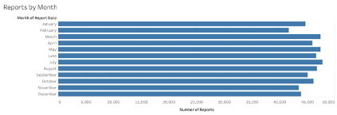
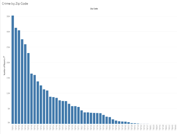

# Austin Crime Rates
Final Project for DA 6813 - University of Texas at San Antonio

## Contributors

- Matthew Smith
- Stuti Singh
- DeRail Spikes

### Background

The capital of Texas is known for many things; music, movies, and more. Every year, hundreds of thousands of people walk through the streets and enjoy what the city has to offer. However, for the 975,000 people living there, and the many more moving in, every day can lead to unfortunate events. Over the course of over 18 years, more than 2 million crimes have been reported to the Austin Police Department, with many more going undetected. One of the biggest concerns residents have is how to keep safe, especially during events taking place in their home.

Texas football, Austin City Limits Music Festival, South by Southwest, and so much more centers around the heart of downtown. Whether it’s bar hopping on Sixth Street and Rainey, taking a dip in Barton Springs, or even walking around the university campus, residents and visitors must be cautious of those with ill intentions.

### Motivation

Over the past several years, the influx of population growth can be attributed to several factors. The University of Texas is home to over 51,000 students and over 14,000 staff members. This academic institution is condensed just north of downtown, where the most foot traffic is recorded. Outside of this radius, there are many companies with operation centers constantly being developed. These include Dell, Samsung, Oracle, IBM, Amazon, and Apple. The term “Silicon Hills” has been coined in reference to this expansion. This analysis is conducted in hopes of potentially providing insight to law enforcement on their efficiency and effectiveness, and informing the public on how to stay safe.

Specific questions for this analysis will focus on:
- When are crimes being reported?
- Where are crimes being reported?
- What types of crimes are being reported?
- What factors can be used to predict where a case will be cleared or not?

### Data

The data is public domain from the Texas Government online. It contains a record of incidents that the Austin Police Department (APD) responded to and reported, and is updated weekly. With 2.23 million rows, the set contains 27 columns (variables) of individual police reports between 1 January 2002 and 13 April 2020. The following table includes a list of the variables and a brief description.

https://data.austintexas.gov/Public-Safety/Crime-Reports/fdj4-gpfu/

| Variable | Description|
| :---     | :---       |
| Incident Number | Recorded incident number |
| Highest Offense Description | Short description of the highest offense on the incident record |
| Highest Offense Code | Code for highest offense |
| Family Violence | Incident involves family violence? (Y or N) |
| Occurrence Date Time | Date/Time format of the occurrence |
| Occurrence Date | Date of occurrence |
| Occurrence Time | Time of occurrence |
| Report Date Time | Date/Time format of report |
| Report Date | Date of report |
| Report Time | Time of report |
| Location Type | Category of type of location |
| Address | Address of incident |
| Zip Code | Zip code of incident |
| Council District | Austin City Council district of incident |
| APD Sector | Austin Police Department sector of incident |
| APD District | Austin Police Department district of incident |
| PRA | Austin Police Department reporting area where incident occurred |
| Census Tract | Census district of incident |
| Clearance Status | Was the crime cleared? C: Cleared, N: Not cleared, O: Cleared by exception |
| Clearance Date | Date incident was cleared |
| UCR Category | Code for the most serious crimes identified by the FBI as part of its Uniform Crime Reporting program |
| Category Description | Major category description of incident |
| X-coordinate | Where incident occurred |
| Y-coordinate | Where incident occurred |
| Latitude | Latitude coordinates of where incident occurred |
| Longitude | Longitude coordinates of where incident occurred |

Instead of looking at the data in its entirety, the focus can be narrowed to between 2014 and 2019, which would reduce the 2.23 million rows. This is a reasonable accommodation given the size of the original dataset and limiting the scope of the analysis to a more recent timeframe would provide more accurate insight in the conducted analyses. The new timeframe would be five complete years of reports. The final year 2020 will not be included in this because the data is only available until April, which would skew the analysis.

### Review of Related Literature

One of the reasons that the Logistic regression classification method was chosen is due to the high interpretability of the predictive model. This is highlighted by an article from the *Methodological Review*, “In logistic regression, the model complexity is already low, especially when no or few interaction terms and variable transformations are used. Overfitting is less of an issue in this case. Performing variable selection is a way to reduce a model’s complexity and consequently decrease the risk of overfitting. (Dreiseitl et al)” It is the simplicity and high interpretability that makes us favor Logistic Regression of the more – admittedly, more robust – but ultimately, more complex models where interpretability may suffer.

When examining Random Forest we look for strengths of the method compared to other classification models we did when exploring Logistic Regression. An article from Andy Liaw and Matthew Wiener, *Classification and Regression by randomForest*, compares and contrasts Random Forest and Decision Trees: “In standard trees, each node is split using the best split among all variables. In a random forest, each node is split using the best among a subset of predictors randomly chosen at that node. This somewhat counterintuitive strategy turns out to perform very well compared to many other classifiers, including discriminant analysis, support vector machines and neural networks, and is robust against overfitting (Breiman, 2001).”

### Proposed Analysis

Multiple visualizations were created in Tableau to answer the questions related to the exploratory analysis. Data regarding the population of Austin was collected from 2002 to 2019 on a line graph and compared to the number of reports between 2002 and 2019. To narrow the scope of the reports to our analysis, the number of reports were restricted to 2015 and 2019.

Bar graphs compared the number of reports based on each day of the week and each month of the year. A bar graph of the highest offense description was made but restricted so that only descriptions with more than 15,000 occurrences were included.  A bar graph also compared the number of reports in each zip code. For the zip code with the highest recorded reports, a bar graph was created to determine which type of crime occurs most, and a line graph was built to see what time of the day the number of incidents are reported.

Another bar graph determined the type of crime occurring most and was compared to the similar bar graph for the zip code with the highest recorded incidents. This graph was recreated, but each bar graph was split by clearance status to see what the distributions were. The time-series of the number of reports between 2015 and 2019 was also recreated and was split by clearance status to see if there was a specific category more prevalent than the others.

A logistic regression was used to identify potential variables that identify variables that contribute to a case being cleared. The response variable “clearance status” is categorical, so the family would be *binomial*. This is important because there could be a predictable pattern that determines whether a case is cleared or not. 

The random forest was also used to identify which variables were important to determining whether or not a crime would be cleared or not. Throughout the modeling process, the random forest determines variable importance and ranks the variables from least important to most important. Variables with high importance are drivers of the outcome and their values have a significant impact on prediction. By contrast, variables with low importance can be omitted from the model, making it simpler and faster to fit and predict.

### Data Exploration

Prior to the analysis, preprocessing of the data was undertaken. The first step was to convert the variables Occurred Date, Report Date, and Clearance Date from characters to dates. Then the variables Family Violence, Location Type, and Clearance Status were converted to factors. Next, we removed the variables X-Coordinate, Y-Coordinate, Latitude, Longitude, and Location. The dataset already included location information in the form of the variables Location Type, Address, and Zip Code which were sufficient for this analysis.

To make the size of the dataset more manageable and get a full understanding of how the variables affect Clearance Status, missing values were omitted. The dataset was then filtered to include observations where the Clearance Status was either C (cleared via an arrest) or N (not cleared). There was a third option O, which was a crime cleared via an exemption. These cases made up an extremely small number of observations, so they were not included in this analysis.

Two variables were created for the purpose of modeling. The first variable, Days to Report, is the difference, in days, between the variables Report Date and Occurred Date. We wanted to see if the delaying of reporting a crime was a factor in whether or not a crime would be cleared. Finally, the variable Cleared was created to be 1 if Clearance Status was C and 0 if it was N. This was done to make the modeling part of this analysis easier. This brought our number of observations to 134,684. The data was split into an 80% training set and a 20% testing split using stratified random sampling.

### Data Analysis

The time-series of Austin’s population shows a steady, almost linear, increase. Starting at just under 700,000, the trend seems to pick up pace in 2005, then return to the original slope in 2017, ending with a population of 960,000 in 2019. If this projection continues, the city will reach a population of one million residents by 2021. Now, the number of incidents over the years has no solid pattern, There are random peaks and troughs that don’t correlate much. Between 2015 and 2019, the number of incidents reported per month fluctuate between 8,000 and 10,000. The minimum was an outlier, at just over 7,500 in February 2018 and the maximum being slightly more than 10,000 in June 2015.

 

When looking at the number of reports by day of the week as a sum throughout the years, Mondays are the peak, then steadily decreases on Tuesdays, Wednesdays, and Thursdays, followed by Fridays with the second highest number of reports. Despite the initial prediction, Saturdays and Sundays are the days with the least number of reports.

When looking at months in the same context (sum throughout the years), the peak is March, followed by July. The peaks are between March and August, followed by a decline in September but an increase again in October. This may be attributed to the various events held in the city during this time such as Austin City Limits Music Festival in the first few weeks, the Texas vs. University of Oklahoma football game, Halloween at the end of the month, and various events held by Greek organizations on campus. November through January decrease again in number of incidents, with the minimum being in February.

The map of the zip codes in Austin show the locations of the Capitol (along with the rest of downtown), and the University of Texas. The bar graph depicting the number of crimes reported per zip code (as a sum over the years) show that the downtown zip code of 78701 is the largest. This can be attributed to the foot traffic and population of the area. Many corporate offices are located there, along with residential buildings. On the weekdays, the workforce saturates the area and, on the weekends, tourists and residents enjoy the scenery and nightlife. This will attribute to the number of crimes occurring.

The 78701 zip code was further analyzed by number of reports in each crime category. Theft was the most common, overtaking the others with almost 9,000 reports over the five-year period. This was followed by aggregated assault, burglary, robbery, auto theft, rape, and murder with each less than 1,000.

The number of reports in this zip code was also analyzed by time. The peak of report time was 3:00 AM followed by a drop of reports, with the least traffic being between 5:00 AM and 6:00 AM. This picks back up over the morning rush hour and a trend appears during standard workday between 10:00 AM and 2:00 PM. This again slowly decreases but picks back up after 9:00 PM. This can be due to the nighttime activities around 6th Street and Rainey Street.

Austin, as an entire city, follows the same pattern with theft being the most common report at over 135,000 over the years, followed by burglary, auto theft, aggravated assault, robbery, rape, and murder.

The variable of interest for both the logistic regression and the random forest model was Cleared (1 if a crime was cleared via an arrest and 0 if the crime was not cleared). Looking at clearance by category description, it is clear that a majority of crimes are not cleared. In every category, except aggravated assault, there are significantly more crimes that are not cleared than cleared. This anomaly for aggravated assault could be a topic explained in a future analysis.

When looking between 2015 and 2019, there are more cases that are not cleared than cleared. There also seems to be a downward trend of cleared cases since 2018. Below that, in red, cases that were cleared but no arrest was made steadies at an average of 500 reports, but after 2018 it drops significantly. This seems to imply that after 2018, the number of crimes being cleared is decreasing.

 

The variables included in the formula for both models were Category Description, Family Violence, Location Type, Zip Code, and Days to Report. The variable Category Description is a factor variable with 7 levels, Family Violence has 2 levels, and Location Type has 44 levels.
The logistic regression provided insight into which variables are statistically significant in terms of the clearance status of these crimes. All the Category Description factor levels are statistically significant: Auto Theft, Burglary, Murder, Rape, Robbery, and Theft. This would seem to indicate that the type of crime is significant in determining the clearance status. The Location Types that were statistically significant were Construction Site, Convenience Store, Department Store, Supermarket, Shopping Mall, Specialty Store, and Transportation. These locations being the most statistically significant makes sense since, as we saw in the visual above, Theft makes up the most crimes in Austin from 2015 to 2019. Most of these factors are stores that have many different items for sale and have high foot traffic, making the probability of theft increase. Theft occurs frequently on construction sites with thieves looking for high value items to resell such as various metals and tools. The variables Zip Code and Days to Report were also statistically significant.

 

The random forest model was used to gain insight into the importance of the variables used for modeling our response variable Cleared. The final model used 500 trees and tried 2 variables at each split. The out-of-bag estimate of the error rate was 11.22%. The three variables that the random forest determined to be the most important were Category Description, Family Violence, and Location Type. This follows from what we saw from the statistically significant variables from the logistic regression.

 

### Conclusions and Recommendations

Downtown Austin, despite being the smallest zip code in the area, has the most amount of crime to match the total traffic that passes through on a daily basis. The most common types of crime in this area are alcohol-related incidents and theft. The trend of when these crimes occur increase as the day goes on, with the most amount occurring between midnight and 3:00 AM. When talking about Austin in general, theft is the most common type of crime reported. Based on the visuals, approximately 6% of thefts occurs Downtown, and remains the most common crime committed.

The logistic regression model showed that several location types around the city of Austin are more prone to crime than others. Location types with high foot traffic and variety in the items they sold were statistically significant according to the logistic regression. These areas include establishments like department stores, malls, and grocery stores. The reason for this is most likely theft. Our analysis showed that theft was one of the most common types of crimes committed in Austin. Since theft is so prevalent in the data, it would be interesting to conduct a similar type of analysis, without theft, to see if the results, especially the significance of various location types, are similar to the ones obtained here. 

In 2018, crime increased with time. Theft increased five times over the course of the year, and the other categories also increased, but less significantly. The number of thefts and alcohol-related incidents will presumably increase, specifically in the Downtown area. The most amount of crime will occur later in the day, most likely between midnight and 3:00 AM, and between March and August.

It is suggested that the Austin Police Department allocate more resources for the 78701 zip code to help the increasing population in the central Austin area. We suggest that the number of officers in the area increase between 9:00 PM and 3:00 AM to combat alcohol-related incidents and thefts that occur in this area.
